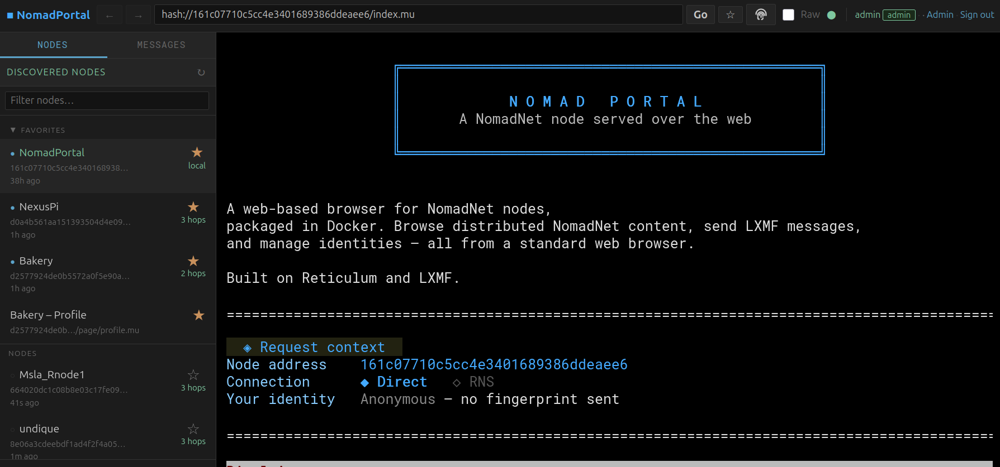

# NomadPortal

[](LICENSE)
[](https://github.com/JamesM92/NomadPortal/actions/workflows/build.yml)
[](https://www.python.org/downloads/)

A web-based browser for [NomadNet](https://github.com/markqvist/NomadNet) nodes, packaged in Docker. Browse distributed NomadNet content, send LXMF messages, and manage identities — all from a standard web browser.

Built on [Reticulum](https://reticulum.network) and [LXMF](https://github.com/markqvist/LXMF).



## Disclaimer

This software is provided **"as is"**, without warranty of any kind, express or implied. The author accepts **no risk and no liability** for any use, misuse, or consequences arising from the use of this project. Anyone who installs, runs, hosts, or otherwise uses this software does so **entirely at their own risk and on their own responsibility** — including but not limited to compliance with applicable laws, the content accessed or transmitted through it, and any harm resulting from its operation.

## Features

- Browse NomadNet pages rendered from Micron markup to HTML
- Send and receive LXMF messages, with per-user inboxes and per-user contact books
- Manage RNS identities and announce to the mesh
- Contact book with MeshChat icon support
- Node discovery via Reticulum announces
- HTTPS with auto-generated self-signed certificate
- Local username/password login or OIDC/SSO (Keycloak, Authentik, Auth0, Google)
- Admin panel for interface configuration, user management, and diagnostics
- Micron-formatted application title with live preview
- Node blocklist for operator abuse response
- Mobile-responsive layout
- Custom 404/500 error pages
- Rate limiting and CSRF protection throughout

## Quick Start

### Requirements

- Docker and Docker Compose v2
- A Reticulum interface reachable from the host (TCP, LoRa, etc.)

### 1. Clone and configure

```bash
git clone https://github.com/JamesM92/NomadPortal.git
cd NomadPortal
```

Edit `docker-compose.yml` and set at minimum:

```yaml
ADMIN_PASSWORD: your-strong-password-here
FLASK_SECRET_KEY: some-random-string-here
```

> **Pre-built image** — every tagged release is also published to the GitHub Container Registry, so you can skip the local build by replacing `build: .` in `docker-compose.yml` with `image: ghcr.io/jamesm92/nomadportal:latest` (or pin a specific version like `:v0.9.0`). `git clone` is still the easiest way to get the docker-compose file and `config/` skeleton.

### 2. Configure Reticulum interfaces

```bash
cp config/config.yml.example config/config.yml
```

Edit `config/config.yml` to enable the interfaces you want (TCP, LoRa via RNode, I2P, AutoInterface, etc.). All interfaces are disabled by default; set `enabled: true` on the ones you want, or use the **Admin → Settings** UI after first start. The Reticulum-side `config/reticulum/config` is regenerated from this file on every start, so don't edit it directly.

### 3. Start

```bash
./start.sh
```

Then open **https://localhost:8443** in your browser. Accept the self-signed certificate warning. HTTP on port 8080 redirects automatically to HTTPS.

To rebuild after a code change:

```bash
./start.sh --build
```

To stream logs to the terminal instead of running in the background:

```bash
./start.sh --fg
```

## Configuration

All options are set via environment variables in `docker-compose.yml`.

### Core

| Variable | Default | Description |
|----------|---------|-------------|
| `ADMIN_USERNAME` | `admin` | Local admin login username |
| `ADMIN_PASSWORD` | *(unset)* | Local admin login password — **required** to enable local login |
| `FLASK_SECRET_KEY` | *(auto-generated)* | Session signing key. Set explicitly so sessions survive restarts |
| `WEB_PORT` | `8080` | HTTP redirect port |
| `WEB_PORT_HTTPS` | `8443` | HTTPS port (main app) |
| `CACHE_TTL` | `300` | Page cache TTL in seconds |
| `LOG_LEVEL` | `INFO` | Python logging level (`DEBUG`, `INFO`, `WARNING`, `ERROR`) |

### Paths

| Variable | Default | Description |
|----------|---------|-------------|
| `RNS_CONFIG_DIR` | `/config/reticulum` | Reticulum configuration directory |
| `CONFIG_YML` | `/config/config.yml` | Optional YAML config file (overrides env vars) |

### Reverse proxy / TLS

| Variable | Default | Description |
|----------|---------|-------------|
| `TRUSTED_PROXIES` | `0` | Number of upstream proxy hops to trust for `X-Forwarded-For`. Set to `1` when behind nginx/Caddy |
| `HTTPS_REDIRECT` | `false` | Set to `true` when TLS is terminated by a reverse proxy and you want the app to redirect HTTP → HTTPS at the application layer |

### OIDC / SSO

| Variable | Description |
|----------|-------------|
| `OIDC_CLIENT_ID` | OIDC application client ID |
| `OIDC_CLIENT_SECRET` | OIDC application client secret |
| `OIDC_DISCOVERY_URL` | Provider discovery URL (see examples below) |
| `OIDC_ALLOWED_EMAILS` | Comma-separated email allowlist (empty = any authenticated user) |
| `OIDC_ALLOWED_SUBJECTS` | Comma-separated subject claim allowlist |
| `OIDC_ADMIN_EMAILS` | Comma-separated list of admin emails |
| `OIDC_ADMIN_SUBJECTS` | Comma-separated list of admin subject claims |
| `OIDC_INSECURE_SKIP_VERIFY` | `true`/`false` — when `true`, NomadPortal skips TLS verification **for the OIDC provider's hostname only**. Use ONLY for trusted-LAN setups with a self-signed Authentik/Keycloak. Logs a warning at startup. |

> If both `OIDC_ADMIN_EMAILS` and `OIDC_ADMIN_SUBJECTS` are empty, OIDC users log in as **non-admins** by default. Use the local admin account (`ADMIN_PASSWORD`) to bootstrap, then promote users from the Users page or set the env-var allowlists. The local admin user is always admin.

**Discovery URL examples:**

| Provider | URL |
|----------|-----|
| Keycloak | `https://auth.example.com/realms/<realm>/.well-known/openid-configuration` |
| Authentik | `https://auth.example.com/application/o/<slug>/.well-known/openid-configuration` |
| Auth0 | `https://<tenant>.auth0.com/.well-known/openid-configuration` |
| Google | `https://accounts.google.com/.well-known/openid-configuration` |

### Setting up Authentik (walkthrough)

1. **Create the Provider.** *Applications → Providers → Create → OAuth2/OpenID Provider*. Client type **Confidential**, copy the auto-generated Client ID and Client Secret. **Redirect URIs** must include `https://<your-nomadportal-host>/auth/callback` (one per line in Strict mode, or use Regex mode for multiple hosts).
2. **Create the Application.** *Applications → Applications → Create*. Set **Provider** to the one above; the **Slug** becomes part of the discovery URL.
3. **Get the Discovery URL.** Authentik shows it on the provider page as the "OpenID Configuration URL". Paste the full URL into `OIDC_DISCOVERY_URL`.
4. **Paste credentials** into `docker-compose.yml` (`OIDC_CLIENT_ID`, `OIDC_CLIENT_SECRET`, `OIDC_DISCOVERY_URL`).
5. **Set a stable `FLASK_SECRET_KEY`** (`openssl rand -hex 32`) so sessions survive restarts.
6. Restart NomadPortal and click **Sign in** — you'll be redirected to Authentik for login.

If your Authentik runs on a self-signed cert (default Docker install on port 9443), set `OIDC_INSECURE_SKIP_VERIFY: "true"` for trusted-LAN setups, or import Authentik's CA into the NomadPortal container for a stricter setup.

Common pitfalls:
- **`redirect_uri_mismatch`** → the redirect URI registered in Authentik must exactly match what NomadPortal sends (including scheme). Behind a reverse proxy, set `TRUSTED_PROXIES: "1"` and `HTTPS_REDIRECT: "true"` so URLs come out as `https://`.
- **`certificate verify failed: self-signed certificate`** → see `OIDC_INSECURE_SKIP_VERIFY` above.
- **Stuck logged-out after a restart** → `FLASK_SECRET_KEY` is empty or changing.

## Using a reverse proxy

If you run NomadPortal behind nginx, Caddy, or similar:

1. Set `TRUSTED_PROXIES: "1"` so client IPs are read from `X-Forwarded-For`
2. Set `HTTPS_REDIRECT: "true"` if you want the app to redirect plain HTTP
3. The self-signed certificate from the entrypoint is only used for direct access — your proxy can terminate TLS with its own certificate instead

Example Caddy snippet:

```
nomadnet.example.com {
    reverse_proxy localhost:8443 {
        transport http {
            tls_insecure_skip_verify
        }
    }
}
```

## SSL certificate

On first start, `entrypoint.sh` generates a self-signed RSA-2048 certificate at `/config/ssl/cert.pem` (valid 10 years). To use your own certificate, place `cert.pem` and `key.pem` in `config/ssl/` before starting.

## Hosting a NomadNet site

NomadPortal can run as a full NomadNet node, serving your own pages and files to any NomadNet client on the mesh.

### Quick setup

1. Add your pages to `./site/pages/` — create at least `index.mu` as your home page
2. Optionally add downloadable files to `./site/files/`
3. Set your node name in `docker-compose.yml`:
   ```yaml
   SITE_NAME: "My Node"
   ```
4. Start (or restart) the container

The node is detected automatically when `./site/pages/` exists. No extra flag needed.

When hosting is active, the web UI automatically loads your site's home page (`index.mu`) for all visitors instead of the default welcome screen.

### Site structure

```
site/
├── pages/                ← .mu pages, served at /page/<filename>
│   ├── index.mu          ← home page (required for custom landing)
│   ├── about.mu
│   └── subdir/
│       └── page.mu       ← reachable at /page/subdir/page.mu
├── files/                ← downloadable files, served at /file/<filename>
│   └── document.pdf
├── lib/                  ← pip install target (managed by NomadPortal)
├── data/                 ← writable directory for SQLite, app state
└── requirements.txt      ← optional, see "Adding Python packages"
```

### Micron pages

Pages are written in [Micron markup](https://github.com/JamesM92/Micron2HTML). Basic example:

```
#!bg=1a1a2a
#!fg=cccccc
>My NomadNet Node

Welcome to my node on the mesh.

`[About`/page/about.mu]  `[Files`/file/]
```

### Executable pages

Pages with the execute bit set (`chmod +x`) are run as scripts. The script's stdout is served as the page content. Useful for dynamic content. Available environment variables:

| Variable | Value |
|----------|-------|
| `node_destination` | This node's destination hex hash |
| `link_id` | Hex ID of the RNS link (unset for local browse from the node owner) |
| `remote_identity` | Hex hash of the requesting identity (set if identified, including for local NomadPortal users) |
| `field_*` / `var_*` | Form field values submitted with the request |
| `PYTHONPATH` | `/site/lib` so packages from `requirements.txt` import |

For a deeper walkthrough — env vars, form handling, persistence, the trust model — see [docs/AUTHORING.md](docs/AUTHORING.md).

### Adding Python packages

Drop a `site/requirements.txt` file in the volume:

```
requests>=2.32
psycopg2-binary>=2.9
```

On the next container start, the entrypoint runs
`pip install --target /site/lib -r site/requirements.txt`. Packages persist
across restarts; first install is slower (download), subsequent starts skip
already-satisfied entries. Executable `.mu` pages can `import` them directly
because `PYTHONPATH=/site/lib` is exported.

For local persistence in your scripts, use `site/data/` and Python's stdlib
`sqlite3` — no install needed. For external databases, add the driver to
`requirements.txt` and connect over the host network.

### Node identity

The node's RNS identity (and thus its mesh address) is stored at `config/reticulum/site_identity.id` and persists across container restarts. The node announces itself to the mesh every 30 minutes and re-scans the pages/files directories every 5 minutes.

### Environment variables

| Variable | Default | Description |
|----------|---------|-------------|
| `SITE_NAME` | `NomadPortal` | Display name announced to the mesh |
| `SITE_PAGES_DIR` | `/site/pages` | Path to pages directory inside the container |
| `SITE_FILES_DIR` | `/site/files` | Path to files directory inside the container |

## Architecture

```
Docker container
├── entrypoint.sh          — generates SSL cert, starts redirect + gunicorn
├── redirect_http.py       — HTTP :8080 → HTTPS :8443 redirect
└── Gunicorn (HTTPS :8443)
    └── Flask app (1 worker, 8 threads)
        ├── Reticulum      — network stack + node discovery
        ├── LXMF           — per-user messaging routers
        └── /config        — volume-mounted persistent storage
```

## Development

Run directly without Docker (requires Reticulum and dependencies installed):

```bash
pip install -r requirements.txt
python app.py
```

CI runs a Docker image build on every push and pull request — see [.github/workflows/build.yml](.github/workflows/build.yml). Tests for the Micron rendering library live in the [Micron2HTML](https://github.com/JamesM92/Micron2HTML) repository.

## Data storage

All persistent data is stored in `./config/` (volume-mounted into the container):

| Path | Contents |
|------|----------|
| `config/reticulum/` | Reticulum config, routing tables, identity keys |
| `config/reticulum/lxmf/` | LXMF message router storage (per-user) |
| `config/identities/` | Named RNS identity keypairs |
| `config/ssl/` | Auto-generated TLS certificate |
| `config/messages.json` | Sent/received LXMF message history |
| `config/contacts/` | Per-user contact books (one file per user) |
| `config/nodes.json` | Discovered NomadNet nodes |
| `config/blocklist.json` | Admin-managed node blocklist |
| `config/favorites.json` | Per-user node favourites |
| `config/users.yml` | User account records |

> **Back up `config/reticulum/identities/` regularly** — these files contain your RNS private keys and cannot be recovered if lost.

## Security notes

- Change `ADMIN_PASSWORD` before exposing the service to any network
- Set `FLASK_SECRET_KEY` to a stable random value so sessions survive restarts
- The self-signed certificate will trigger browser warnings — expected for direct access; use a reverse proxy with a real certificate for public deployment
- CSRF tokens are required on all state-changing requests
- Rate limiting applies to page fetches and message sends
- Session cookies are always marked `Secure` — the service must be accessed over HTTPS
- `robots.txt` is served automatically, blocking search engine indexing of API and admin paths
- See [SECURITY.md](SECURITY.md) for vuln-reporting and full hardening guidance

### Trust model

NomadPortal is a single-operator application. The security boundary is between **the operator** (you) and **the network** (everything else):

- **Logged-in users** can submit forms, send LXMF messages, and (depending on access mode) browse external nodes. They cannot upload content or change configuration unless also admins.
- **Admin users** can edit configuration, change interfaces, and reach the admin panel. Treat the admin role like root on the host.
- **Executable pages in `site/pages/` and packages listed in `site/requirements.txt` are FULLY TRUSTED** — they run as the NomadPortal process. Anything in those locations is effectively code you wrote. **Don't accept user-uploaded `.mu` pages or `pip` packages.**
- **External NomadNet nodes are untrusted.** Their content is HTML-escaped and rendered through Micron2HTML, which has no JavaScript execution path. Field submissions to external nodes go through `_can_interact` access-control gating.

## Operator guidance

NomadPortal acts as a conduit to the NomadNet mesh network. Content fetched from other nodes passes through your server but is not created, selected, or modified by you. The following guidance applies if you expose this service to the public internet:

### Default configuration (recommended for public hosting)

The defaults are conservative and appropriate for site-hosting use cases:

- **Access mode: Gated** — unauthenticated visitors are restricted to your hosted site; the server refuses to fetch pages from other nodes for them. Logged-in users have full access.
- **Nodes/Messages sidebar: Logged-in users only** — reduces surface area for guests
- **Address bar: Hidden for guests** — guests cannot enter arbitrary node addresses

The three access modes (Admin → Settings):

| Mode | Guests | Logged-in users | Admins |
|------|--------|-----------------|--------|
| **Public** | Browse anywhere | Browse anywhere | Browse anywhere |
| **Gated** *(default)* | Restricted to your site | Browse anywhere | Browse anywhere |
| **Locked** | Restricted to your site | Restricted to your site | Browse anywhere |

Setting access mode to "Public" means visitors can browse the full NomadNet network freely. The network is **unmoderated** — content from other nodes may be unsuitable, offensive, or illegal in some jurisdictions. A content warning dialog is shown to logged-in users before they navigate to an external node.

### Liability considerations

This is not legal advice. Consult a lawyer in your jurisdiction before operating a public-facing instance.

- **You are a conduit, not a publisher.** Under most safe-harbour frameworks (US CDA §230, DMCA §512, EU E-Commerce Directive equivalents), operators who do not initiate, select, or modify transmitted content have reduced liability. The key is not to cache content longer than necessary and to respond to abuse reports promptly.
- **Set an abuse contact** in Admin → Settings. This provides users with a way to report problematic content and demonstrates good-faith operation.
- **Use the node blocklist** (Admin → Settings) to block nodes serving harmful content. Keeping a record of your responses to abuse reports is valuable.
- **Page cache** (`CACHE_TTL`, default 300 seconds) briefly stores fetched content on your server. A shorter TTL reduces the window during which cached content is stored. Consider setting `CACHE_TTL: 60` for public instances.
- **LXMF message storage** — sent and received messages are stored in `config/messages.json`. Advise users of this in your terms of service.
- **Private operation** (a closed group with OIDC/OIDC allowlist) carries significantly lower risk than anonymous public access.
- **Jurisdiction matters** — what is legal to transmit in one country is not in another. Know your local laws before operating publicly.

## License

MIT — see [LICENSE](LICENSE).

## Related projects

- [NomadNet](https://github.com/markqvist/NomadNet) — the NomadNet node software
- [Reticulum](https://github.com/markqvist/Reticulum) — the network stack
- [LXMF](https://github.com/markqvist/LXMF) — the messaging protocol
- [Micron2HTML](https://github.com/JamesM92/Micron2HTML) — the Micron → HTML library used by this project
- [Ansi2MicronMU](https://github.com/JamesM92/Ansi2MicronMU) — convert ANSI terminal output to Micron. Useful for exposing existing CLI tools as executable `.mu` pages on your hosted site:
  ```bash
  #!/bin/bash
  git -C /repo log --color=always -n 20 | ansi2micron
  ```
